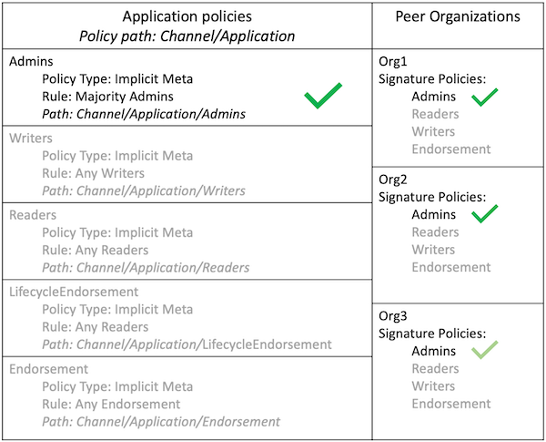
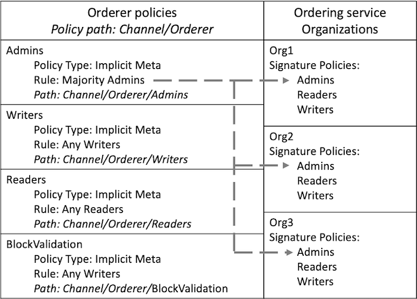
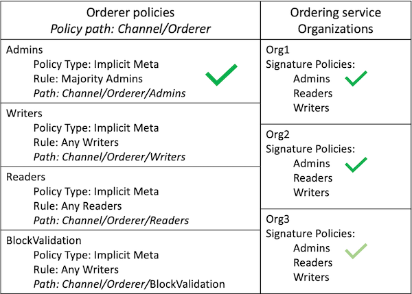

# Channel policies

Channels are a private method of communication between organizations. As a result, most changes to the channel configuration need to be agreed to by other members of the channel. A channel would not be useful if an organization could join the channel and read the data on the ledger without getting the approval of other organizations. Any changes to the channel **structure** need to be approved by a set of organizations that can satisfy the channel policies.

Policies also govern the **processes** of how users interact with the channel, such as the set of organizations that need to approve a chaincode before it can be deployed to a channel or which actions need to be completed by channel administrators.

Channel policies are important enough that they need to be discussed in their own topic. Unlike other parts of the channel configuration, the policies that govern the channel are determined by how different sections of the `configtx.yaml` file work together. While channel policies can be configured for any use case with few constraints, this topic will focus on how to use the default policies provided by Hechain. If you use the default policies used by the Fabric test network or the [Fabric sample configuration](https://github.com/hechain20/hechain/blob/{BRANCH}/sampleconfig/configtx.yaml), each channel you create will use a combination of signature policies, ImplicitMeta policies, and Access Control Lists to determine how organizations interact with the channel and agree to update the channel structure. You can learn more about the role of policies in Hechain by visiting the [Policies concept topic](../policies.html).

## Signature policies

By default, each channel member defines a set of signature policies that references their organization. When a proposal is submitted to a peer, or a transaction is submitted to the ordering nodes, the nodes read the signatures attached to the transaction and evaluate them against the signature policies defined in the channel configuration. Every signature policy has rule that specifies the set of organizations and identities whose signatures can satisfy the policy. You can see the signature policies defined by Org1 in the **Organizations** section of `configtx.yaml` below:
```yaml
- &Org1

  ...

  Policies:
      Readers:
          Type: Signature
          Rule: "OR('Org1MSP.admin', 'Org1MSP.peer', 'Org1MSP.client')"
      Writers:
          Type: Signature
          Rule: "OR('Org1MSP.admin', 'Org1MSP.client')"
      Admins:
          Type: Signature
          Rule: "OR('Org1MSP.admin')"
      Endorsement:
          Type: Signature
          Rule: "OR('Org1MSP.peer')"
```

All the policies above can be satisfied by signatures from Org1. However, each policy lists a different set of roles from within the organization that are able to satisfy the policy. The `Admins` policy can only be satisfied by transactions submitted by an identity with an admin role, while only identities with a peer role can satisfy the `Endorsement` policy. A set of signatures attached to a single transaction can satisfy multiple signature policies. For example, if the endorsements attached to a transaction were provided by both Org1 and Org2, then this signature set would satisfy the `Endorsement` policy of Org1 and Org2.

## ImplicitMeta Policies

If your channel uses the default policies, the signature policies for each organization are evaluated by ImplicitMeta policies at higher levels of the channel configuration. Instead of directly evaluating the signatures that are submitted to the channel, ImplicitMeta policies have rules specify a set of other policies in the channel configuration that can satisfy the policy. A transaction can satisfy an ImplicitMeta policy if it can satisfy the underlying set of signature policies that are referenced by the policy.

You can see the ImplicitMeta policies defined in the **Application** section of `configtx.yaml` file below:
```yaml
Policies:
    Readers:
        Type: ImplicitMeta
        Rule: "ANY Readers"
    Writers:
        Type: ImplicitMeta
        Rule: "ANY Writers"
    Admins:
        Type: ImplicitMeta
        Rule: "MAJORITY Admins"
    LifecycleEndorsement:
        Type: ImplicitMeta
        Rule: "MAJORITY Endorsement"
    Endorsement:
        Type: ImplicitMeta
        Rule: "MAJORITY Endorsement"
```

The ImplicitMeta policies in the **Application** section govern how peer organizations interact with the channel. Each policy references the signature policies associated with each channel member. You see the relationship between the policies in the **Application** section and the policies in the **Organization** section below:

    

*Figure 1: The Admins ImplicitMeta policy can be satisfied by a majority of the Admins signature policies that are defined by each organization.*

Each policy is referred to its path in the channel configuration. Because the policies in the **Application** section are located in the application group, which is located inside the channel group, they are referred to as `Channel/Application` policies. Since most places in the Fabric documentation refer to policies by their path, we will refer to policies by their path for the rest of the tutorial.

The `Rule` in each ImplicitMeta references the name of the signature policies that can satisfy the policy. For example, the `Channel/Application/Admins` ImplicitMeta policy references the `Admins` signature policies for each organization. Each `Rule` also contains the number of signature policies that are required to satisfy the ImplicitMeta policy. For example, the `Channel/Application/Admins` policy requires that a majority of the `Admins` signature policies be satisfied.

    

*Figure 2: A channel update request submitted to the channel contains signatures from Org1, Org2, and Org3, satisfying the signature policies for each organization. As a result, the request satisfies the Channel/Application/Admins policy. The Org3 check is in light green because the signature was not required to reach to a majority.*

To provide another example, the `Channel/Application/Endorsement` policy can be satisfied by a majority of organization `Endorsement` policies, which require signatures from the peers of each organization. This policy is used by the Fabric chaincode lifecycle as the default chaincode endorsement policy. Unless you commit a chaincode definition with a different endorsement policy, transactions that invoke a chaincode need to be endorsed by a majority of channel members.

    

*Figure 3: A transaction from a client application invoked a chaincode on the peers of Org1 and Org2. The chaincode invoke was successful, and the application received an endorsement from the peers of both organizations. Because this transaction satisfies the Channel/Application/Endorsement policy, the transaction meets the default endorsement policy and can be added to the channel ledger.*

The advantage of using ImplicitMeta policies and signature policies together is that you can set the rules for governance at the channel level, while allowing each channel member to select the identities that are required to sign for their organization. For example, a channel can specify that a majority of organization admins are required to sign a channel configuration update. However, each organization can use their signature policies to select which identities from their organization are admins, or even require that multiple identities from their organization need to sign in order to approve a channel update.

Another advantage of ImplicitMeta policies is that they do not need to be updated when an organization is added or removed from the channel. Using *Figure 3* as an example, if two new organizations are added to the channel, the `Channel/Application/Endorsement` would require an endorsement from three organizations in order to validate a transaction.

A disadvantage of ImplicitMeta policies is that they do not explicitly read the signature policies used by the channel members (which is why they are called implicit policies). Instead, they assume that users have the required signature policies based on the configuration of the channel. The `rule` of the `Channel/Application/Endorsement` policy is based on the number of peer organizations in the channel. If two of the three organizations in *Figure 3* do not possess the `Endorsement` signature polices, no transaction would be able to get the majority required to meet the `Channel/Application/Endorsement` ImplicitMeta policy.

## Channel modification policies

The channel **structure** is governed by modification policies within the channel configuration. Each component of the channel configuration has a modification policy that needs to be satisfied in order to be updated by channel members. For example, the policies and channel MSP defined by each organization, the application group that contains the members of the channel, and the components of the configuration that define the channel consenter set each have a different modification policy.

Each modification policy can reference an ImplicitMeta policy or a signature policy. For example, if you use the default policies, the values that define each organization reference the `Admins` signature policy associated with that organization. As a result, an organization can update their channel MSP or set an anchor peer without approval from other channel members. The modification policy of the application group that defines the set of channel members is the `Channel/Application/Admins` ImplicitMeta policy. As a result, the default policy is that a majority of organizations need to approve the addition or removal of a channel member.

## Channel policies and Access Control Lists

The policies within the channel configuration are also referenced by [Access Control Lists (ACLs)](../access_control.html) that are used to restrict access to Fabric resources used by the channel. The ACLs extend the policies within the channel configuration to govern the **processes** of the channel. You can see the default ACLs in the [sample configtx.yaml file](http://github.com/hechain20/hechain/blob/{BRANCH}/sampleconfig/configtx.yaml). Each ACL refers to a channel policy using the path. For example, the following ACL restricts who can invoke a chaincode based on the `/Channel/Application/Writers` policy:
```
# ACL policy for invoking chaincodes on peer
peer/Propose: /Channel/Application/Writers
```

Most of the default ACLs point to the ImplicitMeta policies in the application section of the channel configuration. To extend the example above, an organization can invoke a chaincode if they can satisfy the `/Channel/Application/Writers` policy.

    

*Figure 4: The peer/Propose ACL is satisfied by the /Channel/Application/Writers policy. This policy can be satisfied by a transaction submitted by a client application from any organization with the writers signature policy.*

## Orderer policies

The ImplicitMeta policies in the **Orderer** section of `configtx.yaml` govern the ordering nodes of a channel in a similar way as the **Application** section governs the peer organizations. The ImplicitMeta policies point to the signature policies associated with the organizations that are ordering service administrators.

    

*Figure 5: The Channel/Orderer/Admins policy points to the Admins signature policies associated with the administrators of the ordering service.*

If you use the default policies, a majority of orderer organizations are required to approve the addition or removal of an ordering node.

    

*Figure 6: A request submitted to remove an ordering node from the channel contains signatures from the three ordering organizations in the network, satisfying the Channel/Orderer/Admins policy. The Org3 check is in light green because the signature was not required to reach to a majority.*

The `Channel/Orderer/BlockValidation` policy is used by peers to confirm that new blocks being added to the channel were generated by an ordering node that is part of the channel consenter set, and that the block was not tampered with or created by another peer organization. By default, any orderer organization with a `Writers` signature policy can create and validate blocks for the channel.

<!--- Licensed under Creative Commons Attribution 4.0 International License
https://creativecommons.org/licenses/by/4.0/ -->
